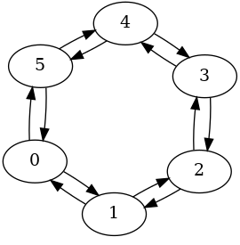

# Backends

## About backends

Our backends are all named following the pattern `[EMU|QPU]:XXQ:NAME`, where:

- EMU or QPU indicates whether this backend is an emulator (EMU) or a real quantum chip (QPU)
- XXQ indicates the maximum number of qubits of circuits supported by the backend (for example 1Q, 7Q, 40Q…)
- NAME describes the chip being used or emulated


ℹ️ Our current backends are all emulators, running in physical or logical mode. 
In the next few weeks, we will add a real chip working in physical mode.
For real chips working in logical mode, give us a little more time 🙂


Supported instructions may depend on the backend you use. Read [Supported instructions](../reference/supported_instructions.md) for more details.

## Listing all available backends

You may list the backends supported by your version of the provider.

To list the backends available in the remote provider:

```python
from qiskit_alice_bob_provider import AliceBobRemoteProvider

# Replace the placeholder with your actual API key in the line below
remote = AliceBobRemoteProvider(api_key='YOUR_API_KEY')

print(remote.backends())
```

To list the backends available for local emulation on your machine:

```python
from qiskit_alice_bob_provider import AliceBobLocalProvider

local = AliceBobLocalProvider()

print(local.backends())
```

Note that some emulators are only supported in remote or in local mode (see below to know which).

If one of the backends listed below does not appear in any of your providers, you may need to update your provider with:

```bash
pip install --update qiskit-alice-bob-provider
```

## List of available backends

| Backend | Available in remote provider | Available in local provider |
| --- | --- | --- |
| [EMU:1Q:LESCANNE_2020](#lescanne-2020) | ✅ | ✅ |
| [EMU:6Q:PHYSICAL_CATS](#6-physical-cats) | ✅ | ✅ |
| [EMU:40Q:PHYSICAL_CATS](#40-physical-cats) | ✅ | ✅ |
| [EMU:15Q:LOGICAL_EARLY](#15-logical-qubits) | ✅ | ✅ |
| [EMU:40Q:LOGICAL_TARGET](#40-logical-qubits) | ✅ | ✅ |
| [EMU:20Q:PERFECT_QUBITS](#perfect-qubits) | ✅ | ❌ |
| [EMU:7Q:TRANSMONS](#transmons) | ✅ | ❌ |

### Lescanne 2020

```python
backend = remote.get_backend('EMU:1Q:LESCANNE_2020')
# or 
backend = local.get_backend('EMU:1Q:LESCANNE_2020')
```

This backend is a numerical model emulating the processor used in the [seminal paper](https://arxiv.org/pdf/1907.11729.pdf) by Raphaël Lescanne in 2020, featuring a single cat qubit.

This numerical model is configured to act as a digital twin of the chip used in this paper, using the following parameters:

- Readout assignment matrix for Mz and Mx: P(1|0)=0.02, P(0|1)=0.06
- Perfect preparation for Px and Pz
- Pauli error probabilities interpolated for the “delay/idle” instruction from the T_bf and Gamma_pf plots in the paper

Please note that this design dates back to 2020 and does not represent the current performance of Alice & Bob's cat qubits. Better designs such as [the ones documented here](https://alice-bob.com/2023/07/21/concept-cats-designing-better-qubits/) have been introduced and will soon be available through Felis.

### 6 physical cats

```python
backend = local.get_backend('EMU:6Q:PHYSICAL_CATS')
# This backend is not available in Alice & Bob Felis cloud service.
```

This backend reproduces the behavior of a chip featuring 6 cat qubits, with a circular neighbor connectivity (each qubit has two neighbors).

It only supports bias-preserving gates (see [Supported instructions](../reference/supported_instructions.md)).

It can be used to implement the smallest error correction code.



This backend is configured to have the same properties as the qubits used in the paper [High-performance repetition cat code using fast noisy operations](https://arxiv.org/abs/2212.11927) [Le Régent et al., 2022]. It is not meant to accurately reproduce a specific current or future Alice & Bob chip.

More details about our assumptions can be found in the comments of the backend’s code: [https://github.com/Alice-Bob-SW/qiskit-alice-bob-provider/blob/main/qiskit_alice_bob_provider/processor/physical_cat.py#L178](https://github.com/Alice-Bob-SW/qiskit-alice-bob-provider/blob/main/qiskit_alice_bob_provider/processor/physical_cat.py#L178)

### 40 physical cats

```python
backend = local.get_backend('EMU:40Q:PHYSICAL_CATS')
# This backend is not available in Alice & Bob Felis cloud service.
```

This backend reproduces the behavior of a chip featuring 40 cat qubits connected in a grid pattern.

It only supports bias-preserving gates (see [Supported instructions](../reference/supported_instructions.md)).

It can be used to implement a long error correction code, or logical operations between several logical qubits using a shorter code.


This backend is configured to have the same properties as the qubits used in the paper [High-performance repetition cat code using fast noisy operations](https://arxiv.org/abs/2212.11927) [Le Régent et al., 2022]. It is not meant to accurately reproduce a specific current or future Alice & Bob chip.

More details about our assumptions can be found in the comments of the backend’s code: [https://github.com/Alice-Bob-SW/qiskit-alice-bob-provider/blob/main/qiskit_alice_bob_provider/processor/physical_cat.py#L178](https://github.com/Alice-Bob-SW/qiskit-alice-bob-provider/blob/main/qiskit_alice_bob_provider/processor/physical_cat.py#L178)


⚠️ Although this backend makes it possible to choose from 40 different qubits, using it to run circuits using more than ~10-15 qubits will likely be slow or fail altogether. The exact limit depends on the capabilities of your machine.


### 15 logical qubits

```python
backend = local.get_backend('EMU:15Q:LOGICAL_EARLY')
# This backend is not available in Alice & Bob Felis cloud service.
```

This backend reproduces what might be the behavior of one of the first useful logical chips, featuring 15 logical qubits with conservative hypotheses on qubit quality.

In this backend, information is physically stored in 13 "data" cat qubits (carrying the information of the logical qubit) and 12 "ancilla" cat qubits (used to perform error detection operations).

Physical qubits are abstracted here - errors are emulated using an analytical formula rather than by emulating the individual behavior of each physical qubit.

Logical error rates are between $10^{-3}$ and $10^{-4}$, but they can be made better (or worse) by tuning the `average_nb_photons`, `kappa_1`, `kappa_2`, and `distance` parameters - see [Chip settings](../reference/supported_instructions.md) for more details.

You get all-to-all connectivity and a universal gate set.

This backend is well-suited to experimenting with logical qubits.

Its performance is not meant to accurately reproduce a specific current or future Alice & Bob chip.


⚠️ The native gate set of this emulator includes a T gate, which is not planned to be a native logical gate in our target architecture.

Our current target logical gate set is Clifford + Toffoli, which has been proved to be universal:
[https://arxiv.org/pdf/quant-ph/0205115.pdf](https://arxiv.org/pdf/quant-ph/0205115.pdf)
[https://arxiv.org/pdf/quant-ph/0301040.pdf](https://arxiv.org/pdf/quant-ph/0301040.pdf)

We are working on a compilation engine which will target Clifford + Toffoli, but our shortcut with the T gate lets you experiment with the logical mode earlier.


### 40 logical qubits

```python
backend = local.get_backend('EMU:40Q:LOGICAL_TARGET')
# This backend is not available in Alice & Bob Felis cloud service.
```

This backend reproduces what might be the behavior of a mature logical chip, featuring 40 logical qubits. It is built using optimistic (but not unrealistic) hypotheses on qubit quality, taken from [this paper](https://arxiv.org/abs/2302.06639) and a distance 15 repetition code.

Just like for `EMU:15Q:LOGICAL_EARLY`, physical qubit behavior is abstracted, you get all-to-all connectivity and a universal gate set (temporarily including a T gate).

Error rates are extremely low (about $10^{-16}$), so this backend should be virtually impossible to distinguish from a noiseless backend when running short circuits.

This backend is well-suited to studying fault-tolerant algorithms on small instances of problems.

Its performance is not meant to accurately reproduce a specific current or future Alice & Bob chip.


⚠️ Although this backend makes it possible to choose from 40 different qubits, using it to run circuits using more than ~10-15 qubits will likely be slow or fail altogether. The exact limit depends on the capabilities of your machine.

By the time we have real chips featuring such low error rates, we will likely have much more than 40 logical qubits. But you’ll need terabytes of memory to run a 40 qubit emulator, so we thought it didn’t make sense to allow more here ;)


### The first QPU

Working on it, coming soon… 🙂

### Perfect qubits

```python
backend = remote.get_backend('EMU:20Q:PERFECT_QUBITS')
# This backend is not available for local emulation.
```

This backend is the Qiskit AER simulator running in noiseless mode, limited to 20 qubits.

It is provided for your convenience.

### Transmons

```python
backend = remote.get_backend('EMU:7Q:TRANSMONS')
# This backend is not available for local emulation.
```

This backend is the Qiskit AER simulator running in noisy mode, with a noise model corresponding to the 7-qubit IBM Perth model. It is provided for your convenience and comparison purposes.