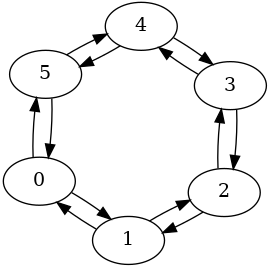

# 40 physical cats

Backend name : `EMU:40Q:PHYSICAL_CATS`

Backend type : Emulator, physical

# About this backend
`EMU:40Q:PHYSICAL_CATS` reproduces the behavior of a chip featuring 40 cat qubits connected in a grid pattern.

It only supports bias-preserving gates (see [Supported instructions](../../reference/supported_instructions.md)).

It can be used to implement a long error correction code, or logical operations between several logical qubits using a shorter code.

This backend is configured to have the same properties as the qubits used in the paper [High-performance repetition cat code using fast noisy operations](https://arxiv.org/abs/2212.11927) [Le Régent et al., 2022].

⚠️ Although this backend makes it possible to choose from 40 different qubits, using it to run circuits using more than ~10-15 qubits will likely be slow or fail altogether. The exact limit depends on the capabilities of your machine.

# Supported backend parameters
- `average_nb_photons`
    - Supported values: 4 and above
- `kappa_1`
    - Supported values: 10 and above
- `kappa_2`
    - Supported values: 100 and above

💡 The `kappa_1 / kappa_2` ratio must be between 1e-7 and 1e-1

Read more about backend parameters [here](../set_parameters.md)

# Supported gates
- `delay`
- `initialize(value, 0)`
    - `value` can only be one of the following: `0`, `1`, `+` or `-`
- `z(0)`
- `x(0)`
- `rz(0)`
- `cx(control_index, target_index)`
- `measure(0, clbit_index)`
- `measure_x(0, clbit_index)`

Read more about supported gates [here](../../reference/supported_instructions.md).

# Supported providers
- ✅ `AliceBobLocalProvider`
- ✅ `AliceBobRemoteProvider`

# Connectivity

# Expected performance
This backend features an error model based on theoretical papers. It is not meant to accurately reproduce a specific current or future Alice & Bob chip.

The formulas and references we used are documented in the source code at https://github.com/Alice-Bob-SW/qiskit-alice-bob-provider/blob/main/qiskit_alice_bob_provider/processor/physical_cat.py

# Availability schedule
As an emulator, this backend is expected to be available 24/7.

Live status for backends is available at [https://api-gcp.alice-bob.com/console/status](https://api-gcp.alice-bob.com/console/status).