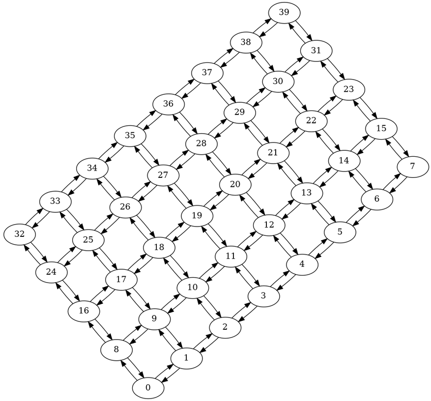

# 40 physical cats

```python
backend = local.get_backend('EMU:40Q:PHYSICAL_CATS')
# This backend is not available in Alice & Bob Felis cloud service.
```

This backend reproduces the behavior of a chip featuring 40 cat qubits connected in a grid pattern.

It only supports bias-preserving gates (see [Supported instructions](../../reference/supported_instructions.md)).

It can be used to implement a long error correction code, or logical operations between several logical qubits using a shorter code.



This backend is configured to have the same properties as the qubits used in the paper [High-performance repetition cat code using fast noisy operations](https://arxiv.org/abs/2212.11927) [Le Régent et al., 2022]. It is not meant to accurately reproduce a specific current or future Alice & Bob chip.

More details about our assumptions can be found in the comments of the backend’s code: [https://github.com/Alice-Bob-SW/qiskit-alice-bob-provider/blob/main/qiskit_alice_bob_provider/processor/physical_cat.py#L178](https://github.com/Alice-Bob-SW/qiskit-alice-bob-provider/blob/main/qiskit_alice_bob_provider/processor/physical_cat.py#L178)


⚠️ Although this backend makes it possible to choose from 40 different qubits, using it to run circuits using more than ~10-15 qubits will likely be slow or fail altogether. The exact limit depends on the capabilities of your machine.