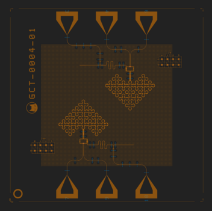

# QPU:1Q:BOSON_4A (or 4B, or 4C)

# About this backend
The `QPU:1Q:BOSON_4x` backends are real quantum chips using a [Boson 4 design](../../reference/boson_4_chips.md), located in Alice & Bob’s offices

 Three chips are currently available in rotation (usually, only one at a time):
 
- `QPU:1Q:BOSON_4A`
- `QPU:1Q:BOSON_4B`
- `QPU:1Q:BOSON_4C`

You may check which chip is currently online on [your status page](https://api-gcp.alice-bob.com/console/status).

Boson 4 chips feature two independant [cat qubits](../../getting_started/why_cat_qubits.md) of identical design, one of which is exposed through this backend.

`QPU:1Q:BOSON_4x` backends are only available through the remote provider, with a Felis Cloud subscription.

💡 **Note:** While all Boson 4 chips feature roughly identical performance, we still expose them as different backends so you can know exactly which chip you used in a given experiment.

# Supported backend parameters
- `average_nb_photons`
    - Supported values: 4 to 16

Read more about backend parameters [here](../set_parameters.md)

# Supported gates
- `delay`
    - 💡 **Note:** Be careful when using long delays. Circuits taking longer than 15 minutes to execute (circuit duration * number of shots) will be refused by our API, so that processing time is shared fairly between all users.
- `initialize(value, 0)`
- `z(0)`
- `x(0)`
    - 💡 **Note:** The `x` gate is implemented virtually in this backend, at the transpilation step
        - For example, `initialize('0', 0)` + `x` is transpiled into `initialize('1', 0)`
- `measure(0, clbit_index)`
- `measure_x(0, clbit_index)`

Read more about supported gates [here](../../reference/supported_instructions.md).

# Supported providers
- ❌ ~~`AliceBobLocalProvider`~~
- ✅ `AliceBobRemoteProvider`

# Connectivity

N/A - This backend features a single qubit.

# Expected performance
See [Boson 4 chips](../../reference/boson_4_chips.md)

# Availability schedule
See [Hardware availability schedule](../../felis_cloud/hardware_availability_schedule.md)