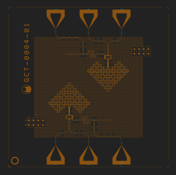

# QPU:1Q:BOSON_4A

# About this backend
`QPU:1Q:BOSON_4A` is a real quantum chip located in Alice & Bob’s offices.

It is the first chip using a [Boson 4 design](../../reference/boson_4_chips.md) ever released by Alice & Bob.

Boson 4 chips feature two independant cat qubits of identical design, one of which is exposed through this backend.

`QPU:1Q:BOSON_4A` is only available through the remote provider, with a Felis Cloud subscription.

# Supported backend parameters
- `average_nb_photons`
    - Supported values: 4 to 16

Read more about backend parameters at (../../reference/supported_instructions.md#backend-parameters)

# Supported gates
- `delay`
    - 💡 **Note:** Be careful when using long delays. Circuits taking longer than 15 minutes to execute (circuit duration * number of shots) will be refused by our API, so that processing time is shared fairly between all users.
- `initialize(value, 0)`
- `z(0)`
- `x(0)`
    - 💡 **Note:** The `x` gate is implemented virtually in this backend, at the transpilation step
        - For example, `initialize('0', 0)` + `x` is transpiled into `initialize('1', 0)`
- `measure(0, clbit_index)`
- `measure_x(0, clbit_index)`

Read more about supported gates [here](../../reference/supported_instructions.md#supported-gates).

# Supported providers
- ❌ ~~`AliceBobLocalProvider`~~
- ✅ `AliceBobRemoteProvider`

# Expected performance
See [Boson 4 chips](../../reference/boson_4_chips.md)

# Availability schedule
See [Hardware availability schedule](../../felis_cloud/hardware_availability_schedule.md)