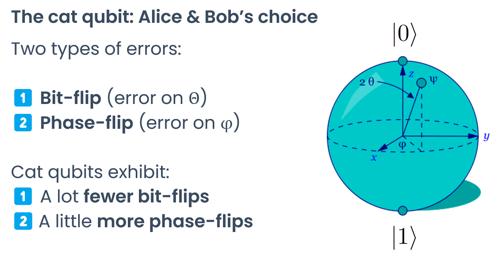

# Working with cat qubits: similarities & differences

In this page, we will assume that you are familiar with transmon qubits like the ones found in IBM systems, and that you have already run circuits using Qiskit.

# TL;DR

## What stays the same:

- You design and run quantum circuits made out of gates and qubits using Qiskit
- You can use most if not all of the gates you are used to (at least in logical mode, see below)

## What is different:

- There are two modes: physical and logical
    - The physical mode mimicks the behavior of physical qubits and features a limited set of gates. Error correction, logical qubits, and logical gates are implemented on top of physical qubits. In this mode:
        - Qubits feature a biased noise (fewer bit-flip errors, more phase-flip errors compared to a regular transmon)
        - You can only use a limited set of gates (so-called “bias-preserving” gates)
        - Additional native operations are available (prepare |+> or |->, measure along the X axis)
        - The chip can be tuned to use a different tradeoff between bit-flip and phase-flip errors
    - The logical mode mimicks the behavior of logical qubits (error-corrected abstract qubits made of several physical qubits). The logical mode features a universal set of gates and is used to run algorithms. In this mode:
        - You can use virtually any gate
        - You get all-to-all connectivity and a very low error rate
        - The noise bias is reduced if not completely eliminated

# What is a cat qubit? What is it good for?

Cat qubits are superconducting qubits which are particularly well-suited to implementing error correction, since they can advantageously trade bit-flip errors for phase-flip errors.

When tuning a specific parameter (the average number of the photons in the cat qubit), the frequency of bit-flip errors decreases exponentially, while the frequency of phase-flip errors increases only linearly.

This “biased noise” makes it possible to virtually eliminate bit-flip errors, while keeping phase-flip errors below the error correction threshold.

This in turn enables much simpler error correction schemes: because there’s virtually only one type of error to correct, you can use a simple repetition code, instead of a surface code that requires far more qubits.

Several physical qubits running a repetition code can then become a “logical qubit”, featuring a much lower error rate than any of the physical qubits it is made of.

Using cat qubits, we estimate we can build a fault-tolerant quantum computer [requiring 60 fewer qubits](https://arxiv.org/abs/2302.06639) than if we were using transmons.

To learn more about the physics of cat qubits, you can read our seminal paper at [https://www.nature.com/articles/s41567-020-0824-x](https://www.nature.com/articles/s41567-020-0824-x) or [https://arxiv.org/abs/1907.11729](https://arxiv.org/abs/1907.11729).

# Logical mode and physical mode

Since the purpose of cat qubits is to create logical qubits with a very low error rate, a processor based on cat qubits can run in two modes: physical and logical.

### Physical mode

In the physical mode, you’re working directly with cat qubits: one qubit in your quantum circuit corresponds to one physical cat qubit on the chip.

This enables you to leverage the biased noise of cat qubits for your error correction experiments, but only lets you use a limited set of gates (see [Supported instructions](../going_further/supported_instructions.md) for more details).

Indeed, when using cat qubits in physical mode, it only makes sense to use so-called “bias-preserving” gates, which do no leak information from the noisy phase channel to the clean bit channel.

This means that gates such as the Hadamard gate are forbidden, since they do contaminate the bit channel with phase errors.

In physical mode, you’ll also need to take the chip’s connectivity into account, since cat qubits are usually only connected with their nearest neighbor. Although Qiskit’s transpiler can do this job for you, transpilation may push the qubit number beyond the limits of what the emulator or the chip can do.

You’ll use the physical mode if you want to study the **properties of cat qubits**, implement **error correction** or create your own **logical qubit**.

### Logical mode

In the logical mode, you’re working with error-corrected logical qubits: one qubit in your quantum circuit corresponds to a group of several physical qubits on the chip.

This mode is more abstract that the physical mode, since all the error correction operations leveraging several physical qubits are hidden in the compilation step.

But **the logical mode is the perfect choice to run quantum algorithms**: you can execute any quantum gate, you get low error rates and all-to-all connectivity.

Also, the logical mode does not feature a noise bias as strong as in physical mode. The exact bias depends on the tuning of the chip (distance of the code, number of photons), but a good tuning can make bit-flip and phase-flip errors equally (un)likely.

The logical mode is only possible with chips featuring enough physical cat qubits to run an effective error correction code. We estimate this minimal number to be somewhere between 5 (for a first demonstration of a single logical qubit) and 40 (for very high fidelities or multi-qubit logical operations).