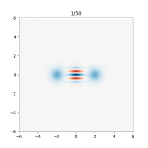

# Boson 4 chips

## The Boson 4 design

Boson 4 is part of the “Boson” series of chip designs, meant to demonstrate promising ways of implementing [cat qubits](../getting_started/why_cat_qubits.md).

Just like its two predecessors, Boson 4 is a transmon-free design. This enables it to reach very long bit-flip lifetimes (up to 276 seconds measured in Alice & Bob’s lab).

As its name suggests, Boson 4 follows three previous designs:

- [Boson 1](https://www.nature.com/articles/s41567-020-0824-x) is the design which started Alice & Bob. It demonstrated the possibility to exponentially suppress bit-flips, while only linearly increasing phase-flips. Its bit-flip lifetime however saturated at 1 ms, due to the presence of a transmon in the experimental setup.
- [Boson 2](https://arxiv.org/abs/2204.09128) showed it is possible to take bit-flip lifetime up to 100 seconds by removing the transmon from the setup. This design however lacked the possibility to measure phase-flips.
- [Boson 3](https://arxiv.org/abs/2307.06617) improved upon Boson 2 by introducing a new readout protocol making it possible to do transmon-free measurements along the X and the Z axis. Its bit-flip lifetime reached over 10 seconds.

Boson 4 uses the same readout protocols as Boson 3, but manages to reach longer bit-flip lifetimes than any of its predecessors.

A Boson 4 chip features two independent cat qubits, which are not coupled with one another.

We are currently working on a paper giving a more detailed description of the Boson 4 design.

## Available Boson 4 backends

You may run circuits on a Boson 4 chip using the [`QPU:1Q:BOSON_4A`](../backends/backends_list/boson_4a.md) backend ([Felis Cloud](../felis_cloud/about_felis_cloud.md) subscription required).

## Main performance figures

The figures below can all be reproduced using [this notebook](https://github.com/Alice-Bob-SW/felis/blob/main/samples/1_hardware_experiments/2%20-%20Boson%204%20tutorial.ipynb)

### Lifetime

These figures represent the chip's bit-flip and phase-flip lifetime.

When preparing the $\ket{0}$ state, the probability of a Z measurement yielding 0 after a delay of duration $t$ decays as $\exp(-t/T_{bf})$, where $T_{bf}$ is the bit-flip lifetime.

When preparing the $\ket{+}$ state, the probability of an X measurement yielding + after a delay of duration $t$ decays as $\exp(-t/T_{pf})$, where $T_{pf}$ is the phase-flip lifetime.

|  | average_nb_photons = 4 | average_nb_photons = 16 |
| --- | --- | --- |
| Bit-flip | 1 ms | > 100 seconds |
| Phase-flip | 1 µs | 0.5 µs |

💡 **Note:** Measuring lifetimes over 100 seconds is challenging using repeated measurements and a chip shared between users:

- Doing 1000 shots of a 100-second experiment takes almost 28 hours
- Doing shorter experiments yields too few errors; this requires using more shots and does not make experiments significantly shorter

We are working on adding the “real-time trajectories” protocol described in [this paper](https://arxiv.org/pdf/2307.06617.pdf), which enables shorter measurements.

💡 **Note:** if you're used to working with transmons, you know that state decay only happens if you start from the $\ket{1}$ state. With cat qubits, the $\ket{0}$ and $\ket{1}$ states are virtually interchangeable. Experimental differences might remain, but they're mostly due to sampling noise and calibration inaccuracies.

### SPAM errors

These figures represent sequence error (# shots giving the expected result / # of shots).

| Sequence | average_nb_photons = 4 | average_nb_photons = 16 |
| --- | --- | --- |
| P0 - Mz | 2 % | < 0.001 % |
| P+ - Mx | 41 % | 47 % |

💡 **Note:** As you notice, while this chip's bit-flip performance is stellar, the phase-flip performance is still somewhat underwhelming.

Cat qubit architectures are less demanding regarding qubit quality (a repetition code has a higher threshold than a surface code), but phase-flip performance still needs to improve by 1 to 2 orders of magnitude for error correction to work reliably. We are focused on improving this, with several promising solutions being tested in our lab. Stay tuned!

Or, if you think this is an interesting research topic, don't hesitate to [drop us a line](../contact_us.md), we are happy to explore potential collaborations.

💡 **Note:** If you run your own experiments, you will notice that P1 - Mz does not give the same results as P0 - Mz. This is because while our [state preparation](#initialize0-or-1) is symmetrical, our [readout protocol](#measure) is not. We could have randomly mapped $\ket{0}$ to $\ket{+\alpha}$ or $\ket{-\alpha}$, which would have yielded symmetrical results on average, but we chose to stay closer to the behavior of the physical system.

### Z gate performance

These figures represent the probability of getting a bit-flip or phase-flip during a Z-gate.

|  | average_nb_photons = 4 | average_nb_photons = 16 |
| --- | --- | --- |
| Bit-flip | 0.15 % | < 0.001 % |
| Phase-flip | 20 % | 40 % |

### Chip parameters

These parameters were measured in Alice & Bob’s lab and cannot be reproduced using Felis.

| Metric | Measured value |
| --- | --- |
| f_a | 1.079 GHz |
| f_b | 7.898 GHz |
| κ_1/2π | 2.26 kHz |
| κ_1_eff/2π | 22.7 kHz |
| κ_b/2π | 22 MHz |
| κ_2/2π | 250 kHz |
| g_2/2π | 1.2 MHz |
| K/2π | -12 kHz |
| κ_φ/2π | ... kHz |
| n_th | 2 |
| n_th_buffer | not measured |

## Gate implementation details

There are three types of gates available: 

- "preparation gates" (P0, P1, P+, P-), used to initialize the state of the cat on some remarkable spots on the Bloch sphere;
- "one-qubit operations" (Z, I), used to transform one state into an other one
- "measurement gates" (MX, MZ), used to measure the state of the qubit.

*Bloch sphere for cat qubits. The Z basis states is constituted from the stable coherent state, while the X axis basis is constituted from the even and odd cat states.*

For cat qubits, the basis states along the Z axis and the X axis are not equivalent. Indeed, the states along Z are stable (long lived) since they are protected by the two-photon dissipation process, while the states along the X axis are not protected: their lifetime is given by the lifetime of the memory under pump.

Therefore, we can regroup the available gates into two families: the Z family associated to the the Z basis (P0, P1, I, MZ), and the X family associated to the X basis (P+, P-, Z, I, MX).

Furthermore, each of these gates should be ''bias preserving'', which means that they preserve the high stability of the Z axis. In the following, we present each of these gates according to the Z and X family classification.  

### initialize('0' or '1')

The preparation of the states $\left|0\right\rangle$ and $\left|1\right\rangle$ is done by displacing the memory from the vacuum state to the given locations $\alpha$ and $-\alpha$ respectively in phase space. This displacement is achieved by driving the memory resonantly while the two photon stabilization is turned off, for a given fixed duration and complex amplitude that has already been calibrated (figure).

*Pulse sequence for preparing $\left|0\right\rangle$ and $\left|1\right\rangle$ with a resonant drive on the memory.*

### initialize('+')

Preparing the cat state $\left|+\right\rangle$ is done by ''inflation from vacuum.'' Starting from an empty memory, we turn on the two photon stabilization and the buffer drive, thereby leading to a stabilized cat state for timescales greater than $1 /\kappa_2$ : this process is called an ''inflation''. Since the parity of the state is preserved through this process, the stabilized cat state will be the even cat state $\left|+\right\rangle$. 

*Pulse sequence for preparing the even cat $\left|+\right\rangle$, and the corresponding Wigner figure*

### initialize('-')

Preparing the odd cat state $\left|-\right\rangle$ is done by applying a gate $Z_{\pi} $ to the even cat state $\left|+\right\rangle$.

*Pulse sequence for preparing $\ket{-}$*

### measure

Given a state $\left|\psi\right\rangle = a \left|0\right\rangle + b\left|1\right\rangle = a \left|\alpha\right\rangle + b\left|-\alpha\right\rangle + O\left(e^{-2|\alpha|^2}\right)$, the measurement of Z is done using the ''Cat Longitudinal Readout'' (CaLoR) protocol. It consists in turning off the 2 photon pump, then displacing the resulting state by $+\alpha$, and finally reading out the number of photons. 

The result of the displacement is a state $\left|\psi'\right\rangle \equiv D(\alpha)\left|\psi\right\rangle = a \left| 2\alpha \right\rangle + b\left|0\right\rangle$. Reading out the number of photons of $\left|\psi'\right\rangle$ yields the number $4 |\alpha|^2 |a|^2 $, which directly relates to $\left\langle \psi' |Z| \psi' \right \rangle = |a|^2 - |b|^2 = 2 |a|^2 - 1$ (recall that $|\alpha|^2 $ is a fixed quantity). Note that this measurement is destructive: it does not preserve the state, so the cat is dead after this readout!  

*Pulse sequence for the MZ measurement gate*

**Calibration:**
In practice, we perform the complementary operation with the opposite displacement $D(-\alpha)$ to subtract eventual drifts in the measurement. Furthermore, since we are only concerned in the two pointer states $\left|0\right\rangle$ and $\left|1\right\rangle$, the distinction between the two can be enhanced using thresholding. Finally, the number of photons is measured through the ''longitudinal readout'' protocol (see [Réglade, Bocquet, ''et.al.'' '''Nature''' (2024)](https://arxiv.org/abs/2307.06617) for more details).

### measure_x

Parity measurement is done by mapping the parity basis to the logical basis via a $Y_{\frac{\pi}{2}} = Z_{\frac{\pi}{2}} X_{\frac{\pi}{2}} $ gate $\{\left|+\right\rangle, \left|-\right\rangle\}  \rightarrow \{\left|0\right\rangle, \left|1\right\rangle\}$ . In practice this is realized through the ''Holonomic sequence'' which consists of a $Z_{\frac{\pi}{2}} $gate followed by a deflate and orthogonal inflate.

 

*Pulse sequence and Wigner figures for the MX measurement gate*

### z

The Zeno gate allows to change the phase $\phi$ of the logical states superposition $\frac{\left|0\right\rangle + e^{i\phi} \left|1\right\rangle}{2}$, and thus for example change the parity of a cat state $Z_{\frac{\pi}{2}} \left|+\right\rangle = \left|-\right\rangle$. Zeno gate is realized by driving the memory resonantly with a phase orthogonal to the stabilization axis, while stabilizing the memory. The resonant memory drive causes the fringes to roll with a frequency $\Omega_z= 4\alpha\epsilon_z$ proportional to the cat size $\alpha$ and the Zeno drive amplitude $\epsilon_z$.

*Pulse sequence and Wigner figure for Zeno pulse while stabilizing cat qubits*

### reset

Resetting the memory is done by activating a so called SWAP interaction with the buffer $H_{\rm SWAP} = g_1 a^\dagger b + g_1^*a^\dagger b$. Since the buffer is cold and relaxes quickly to the environment, the memory will be endowed with a strong 1 photon loss mechanism, leading it to empty to the vacuum state.

*Reset pulse sequence : it consists in a single pump tone applied for a given duration*